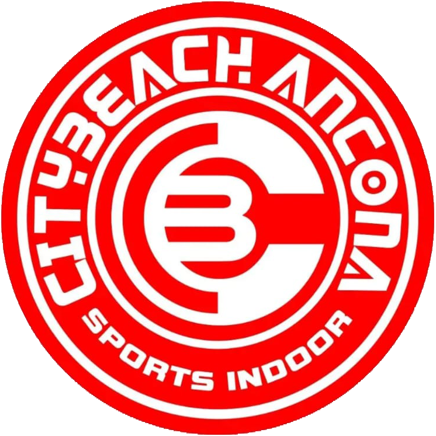
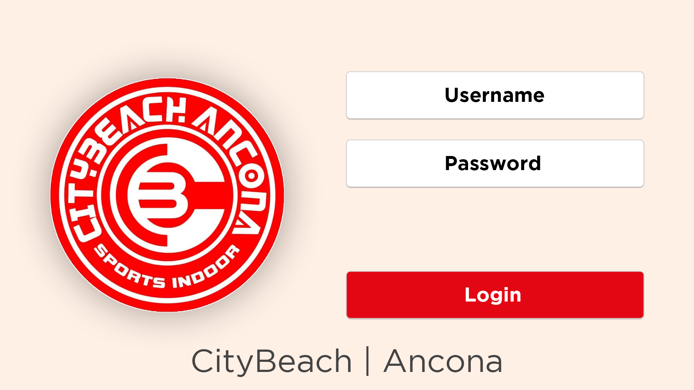
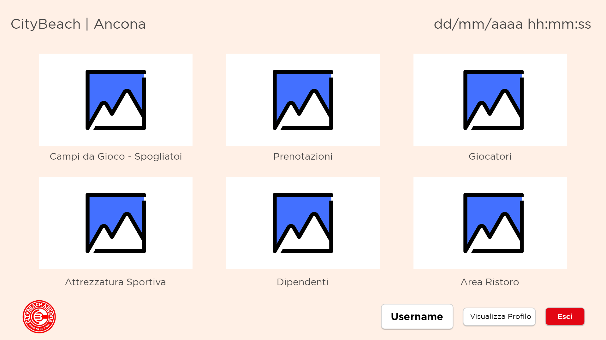
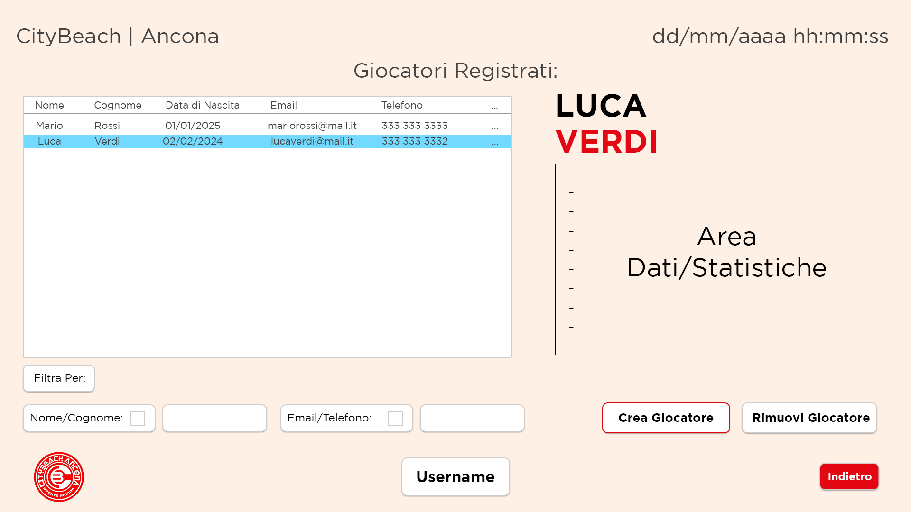
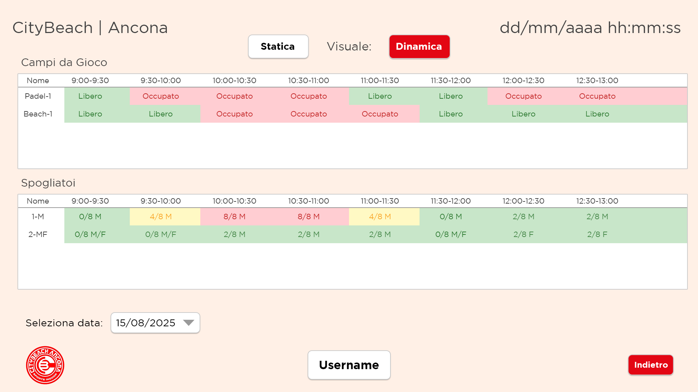
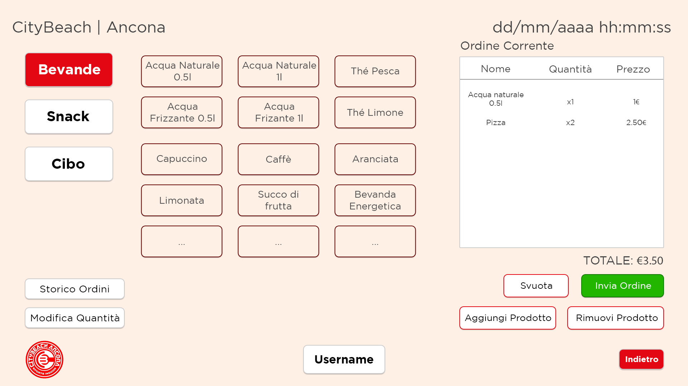

# 🏖️ CityBeach Ancona

[](README.md)
[](README.it.md)

CityBeach Ancona è un software gestionale **desktop** per il **Palabeach** di Ancona, sviluppato come parte del corso di **Ingegneria del Software (IDS)** presso l’**Università Politecnica delle Marche (UNIVPM)**.  

<p align="center">
  
</p>

L’applicazione è attualmente in fase di sviluppo attivo e segue l’architettura **MVC (Model-View-Controller)**.  
L’interfaccia grafica è realizzata con **PyQt6**.  

---

## 📌 Panoramica

CityBeach è pensato per semplificare la gestione quotidiana di un impianto sportivo balneare.  
Consente ad amministratori e staff di gestire:

- 👤 Utenti e giocatori  
- 🏐 Inventario attrezzature sportive  
- 📆 Prenotazioni e tracciamento utilizzo  
- 🏅 Campi e spogliatoi (monitoraggio occupazione per evitare sovraffollamento)  
- 🍔 **Area ristoro** con gestione prodotti e ordini  

> ⚠️ Il software è un progetto universitario e **non è ancora pronto per l’uso in produzione**.  

---

## 🖥️ Tecnologie

- **Python 3.13**
- **PyQt6**
- **Pickle**
- **MatPlotLib**
- **OOP (Object-Oriented Programming)**
- **Architettura MVC**
- **Font personalizzati (Gotham)**
- **Immagini con licenza Freepik**

> Attualmente non è presente un database.  
> I dati sono gestiti in memoria o tramite oggetti Python statici.  

---

## 🗂️ Struttura del Progetto
```
CityBeach/
├── main.py
├── paths.py
├── requirements.txt
├── Controller/
│   ├── BookingsController.py
│   ├── FieldsController.py
│   ├── LockersController.py
│   ├── PlayersController.py
│   ├── RestaurantController.py
│   ├── SportsEquipmentController.py
│   └── UsersController.py
├── Model/
│   ├── Booking.py
│   ├── Data.py
│   ├── Field.py
│   ├── Gender.py
│   ├── Locker.py
│   ├── Order.py
│   ├── Player.py
│   ├── Product.py
│   ├── SportsCategory.py
│   ├── SportsEquipment.py
│   └── User.py
├── src/
│   └── fonts/
│       ├── Gotham-Black.otf
│       ├── Gotham-Thin.otf
│       ├── Gotham-ThinItalic.otf
│       ├── Gotham-UltraItalic.otf
│       ├── GothamBold.ttf
│       ├── GothamBoldItalic.ttf
│       ├── GothamBook.ttf
│       ├── GothamBookItalic.ttf
│       ├── GothamLight.ttf
│       ├── GothamLightItalic.ttf
│       └── GothamMediumItalic.ttf
├── UnitTestCase/
│   ├── BookingTestCase.py
│   ├── RestaurantTestCase.py
│   └── UserTestCase.py
└── View/
    ├── AttrezzaturaSportiva_ui.py
    ├── Booking_ui.py
    ├── DateTimeLabel.py
    ├── Employee_ui.py
    ├── Fields_Locker_ui.py
    ├── Login_ui.py
    ├── Main_ui.py
    ├── Player_ui.py
    ├── Restaurant_ui.py
    ├── styles.py
    ├── topBar.py
    └── View.py
```

---

## 🚧 Stato di Sviluppo

| Funzionalità                                   | Stato        |
| ---------------------------------------------- | ------------ |
| Struttura base UI                              | ✅ Completata |
| Architettura MVC                               | ✅ Completata |
| Gestione attrezzature e utenti                 | ✅ Completata |
| Persistenza dati (file locale `data.pkl`)      | ✅ Completata |
| Autenticazione e ruoli                         | ✅ Completata |
| Gestione campi e spogliatoi                    | ✅ Completata |
| Sistema prenotazioni                           | ✅ Completata |
| Gestione attrezzature sportive                 | ✅ Completata |
| Gestione area ristoro                          | ✅ Completata |
| Styling finale & layout responsivo             | 🔄 In corso   |
| Generazione report (PDF)                       | 🔄 In corso   |

---

## 📖 Utilizzo

### ‼️ Primo Accesso
Al primo avvio utilizzare le credenziali predefinite:
```
👤 Username: admin
🔑 Password: admin
```
> ⛔️ L'account "admin" esiste sempre e non può essere modificato o eliminato.

### 📋 Pannelli Funzionali

- **Employees Panel**  
  Gestione di tutti gli utenti del sistema (staff e non staff).  
  - Alla creazione di un nuovo utente, la password è vuota (`""`).  
  - L’amministratore può modificare un utente e reimpostarne la password, ma non recuperarla.

- **Players Panel**  
  Gestione dei profili giocatori.  
  Per effettuare una prenotazione è necessario selezionare un giocatore registrato.

- **Fields & Lockers Panel**  
  Gestione dei campi e degli spogliatoi disponibili.  
  - **Vista statica:** panoramica completa con caratteristiche principali e grafici statistici.  
  - **Vista dinamica:** selezione data → visualizzazione stato campi/spogliatoi per ogni fascia oraria.  

  > Sport supportati: Beach Volley, Padel, Beach Tennis

- **Bookings Panel**  
  Creazione nuove prenotazioni (**solo da oggi in poi**).  
  Stato aggiornato automaticamente:  
  📅 **REGISTERED → IN PROGRESS → COMPLETED**  

- **Restaurant Panel (Area Ristoro)**  
  Gestione dei prodotti divisi per categoria:  
  - 🥤 Bevande  
  - 🍷 Alcol  
  - 🍔 Cibo  
  - 🍫 Snack  

  I prodotti possono essere inseriti negli **ordini**, consultabili in un’apposita sezione.

---

## 💻 Some Mockup
<p align="center">
  <table>
    <tr>
      <td></td>
      <td></td>
      <td></td>
    </tr>
  </table>
  <table>
    <tr>
      <td></td>
      <td></td>
    </tr>
  </table>
</p>

---

## 📄 Licenza

Il progetto è sviluppato per scopi accademici e non è ancora distribuito sotto una licenza open-source specifica.  
Le condizioni di licenza verranno definite in seguito.  

---

## 📬 Contatti

Per domande, suggerimenti o collaborazioni:  

- 📧 s1116714@studenti.univpm.it  | Alessandro Zingaretti  
- 📧 s1118107@studenti.univpm.it  | Lorenzo Rossetti  
- 📧 s1115276@studenti.univpm.it  | Tomas Mosciatti  
